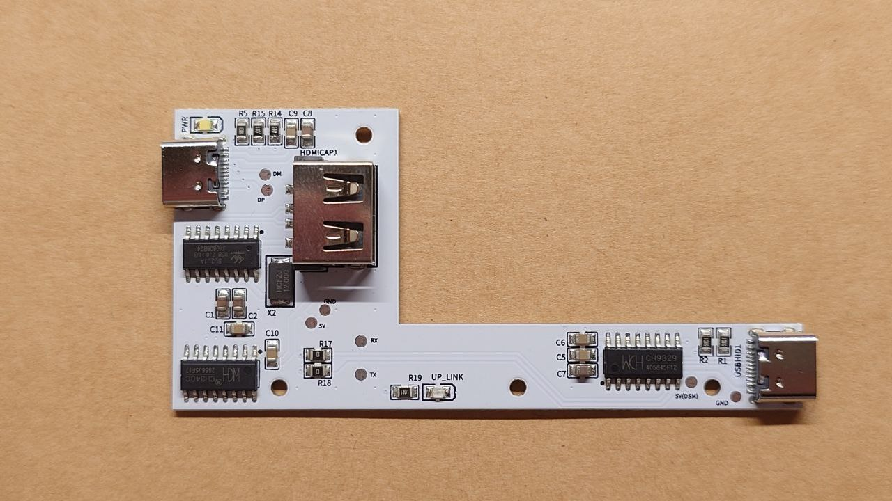
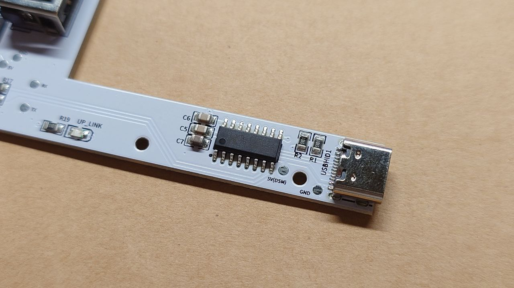
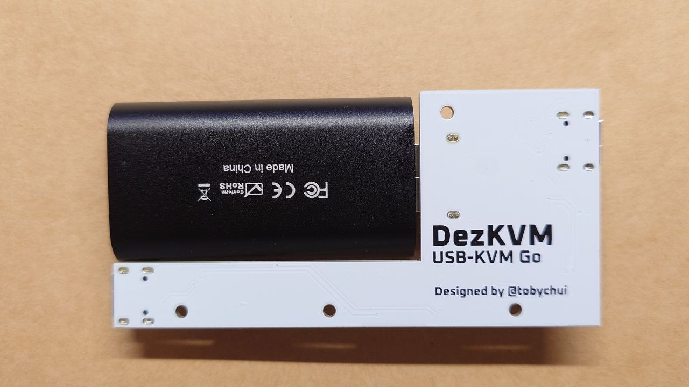
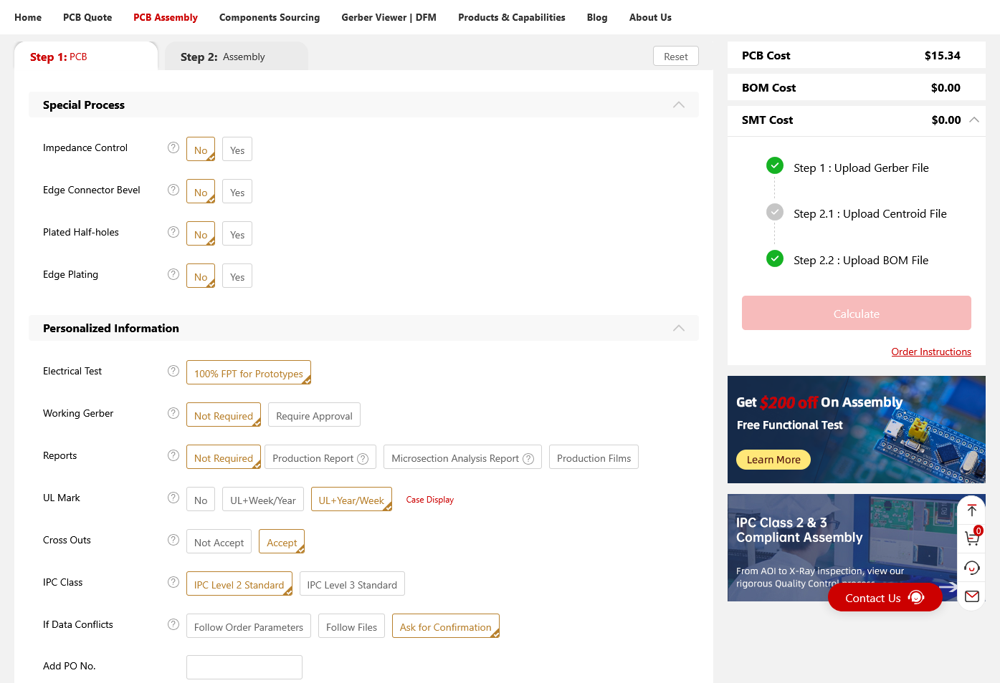
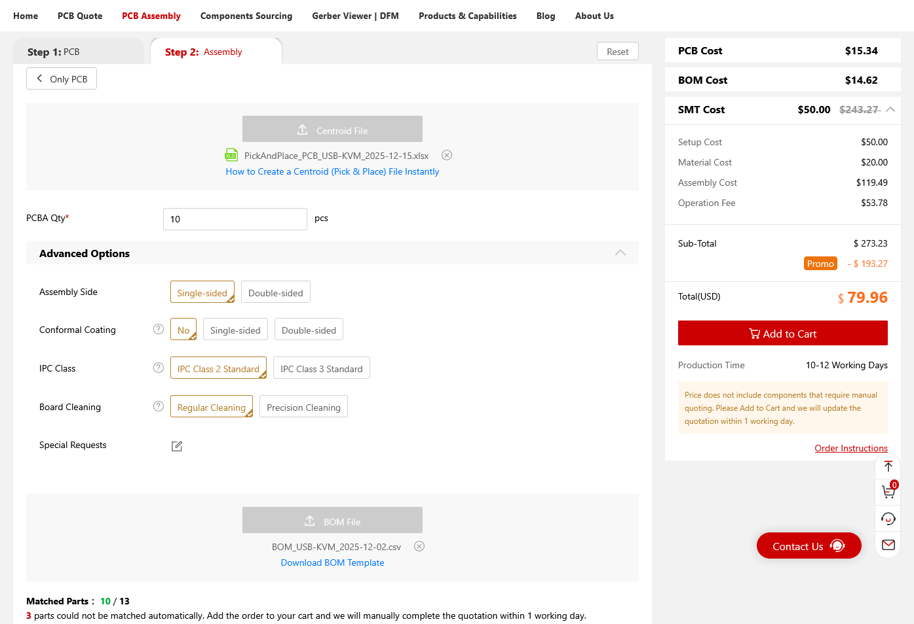
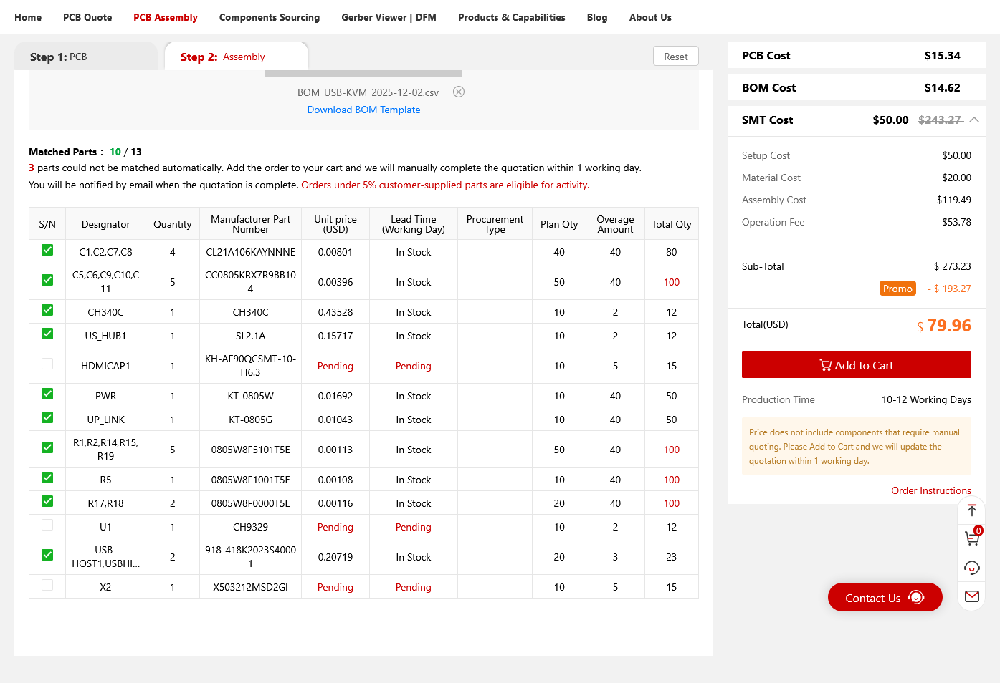

## Making your own DezKVM-GO Hardware

Making your DezKVM Go hardware is not difficult. What you need is to send the PCB to print. If you have the budget, you can even go the full PCBA route and make a ready to use product with the help of [NextPCB](https://www.nextpcb.com/?code=tobychui/C) (sponsor of this project)

### PCB Photoshoots

That cutout is for the MS2109 HDMI capture card. You can easily find one on Amazon for around 9 - 12USD. After inserting the capture card, the whole circuit should looks like this.

### What PCB manufacturing parameters should I pick?

Here are the parameters and properties I pick for making the PCB above. You can upload the Gerber file to [NextPCB](https://www.nextpcb.com/?code=tobychui/C) website and following the options in the screenshot below to make yours.

For details, see the BOM list and Gerber files.