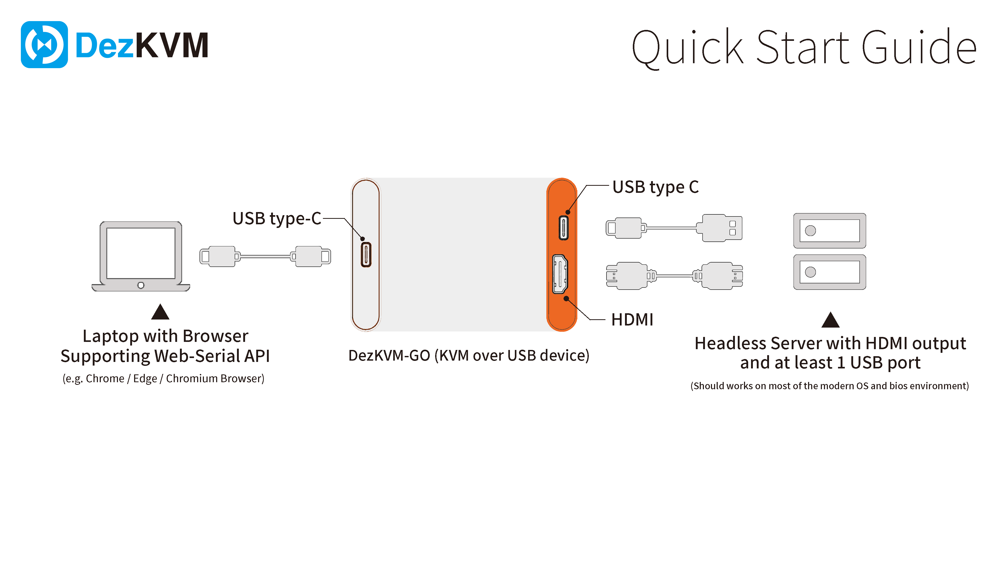
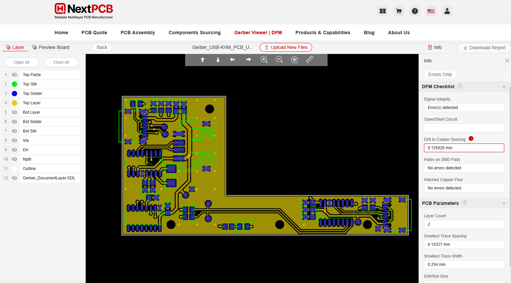
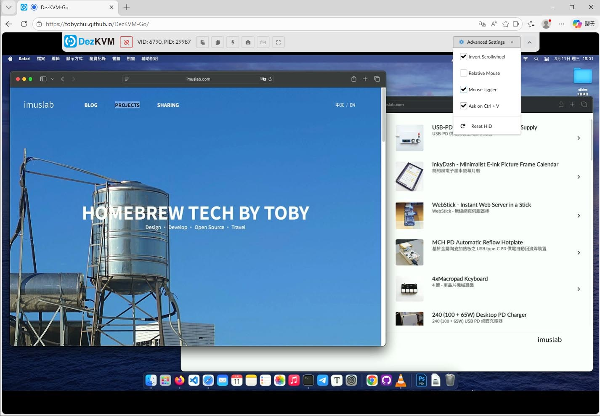
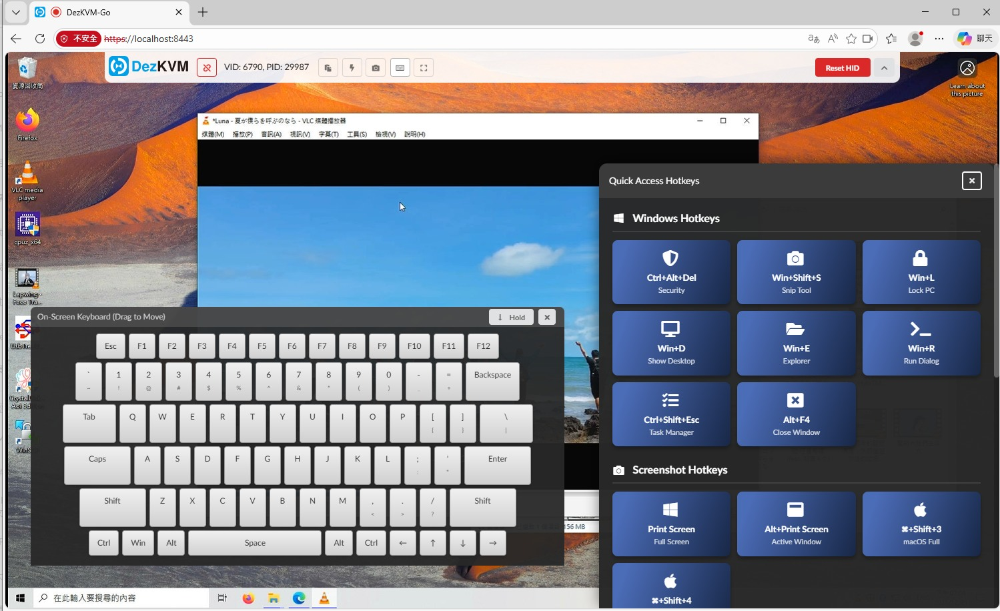
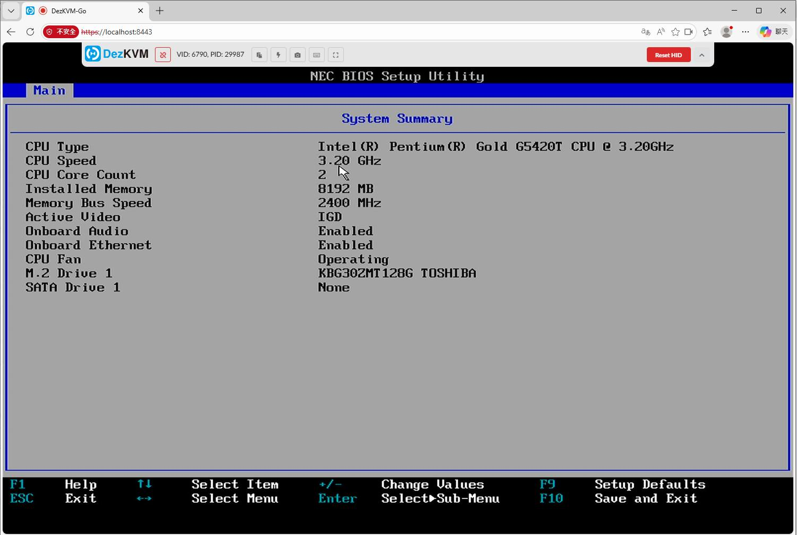

# DezKVM-Go

A mini KVM over USB device for onsite engineers to use their laptop to control headless computers or servers.

## Features

- Small form factor , just 84 x 53 x 18mm
- Cheap to build, costing just under $20 USD per unit
- Fully featured software that do not require installing any apps
  - Live video and audio feeds
  - Paste box (host to remote computer through automatic virtual keyboard HID events)
  - On-screen keyboard
  - Commonly used Hot-key and macros
  - Take Screenshots

## Usage

1. Insert the DezKVM-Go host side USB port into your laptop using a USB type-C cable (located on the white / black side, depends on your device casing color)
2. Insert the DezKVM-Go remote side USB port and HDMI port into the remote server or computer you want to control (located on the orange side)
3. Visit the [DezKVM-Go control panel](https://tobychui.github.io/DezKVM-Go/) or if you are working online, start the usbkvm application and visit `https://localhost:8443/` using Chrome, Edge or any Chromium browsers that support Web-Serial API.

## Quick Start




## Build the Hardware

To build the hardware, you will need the following items

- A DezKVM-Go PCB (See the `PCB` folder and the `how-to-place-order` folder on how to order them )
  
- A MS2109 HDMI capture card (usually around $7 - 9 USD a pcs)
- A 3D printer (for the case, see `3D Models` folder)
- M3x10 screws x 2
- USB type-C cable x 2 and HDMI cable x 1


## Build the Software

There is no need to build anything since all of the control code of this system is written in vanilla js in the web front-end. However, this project do come with a Golang written https server in which if you have difficulties deploying a website with https , you can use that https server to deploy a locally hosted version of the DezKVM viewer.

To build the local version of DezKVM viewer, follow the instruction below.

```bash
cd ./src
go mod tidy
go build
```


## Screenshots








## License

GPLv3


## Sponsors

This project is a collaboration with NextPCB, thanks for sponsoring this project!


