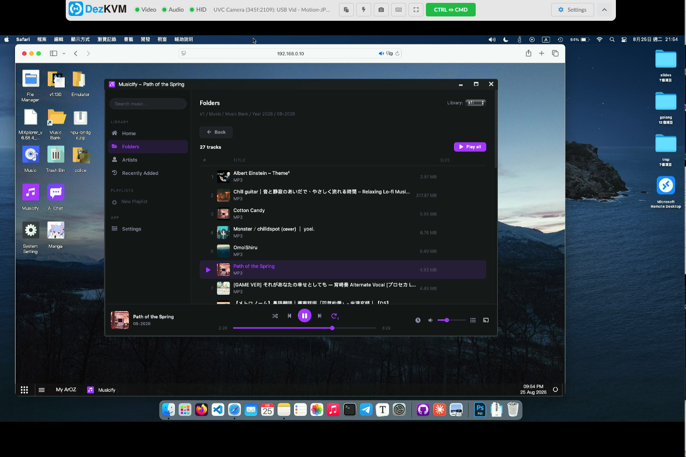
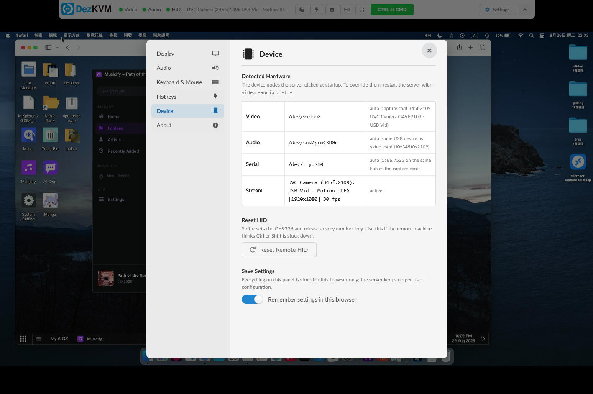
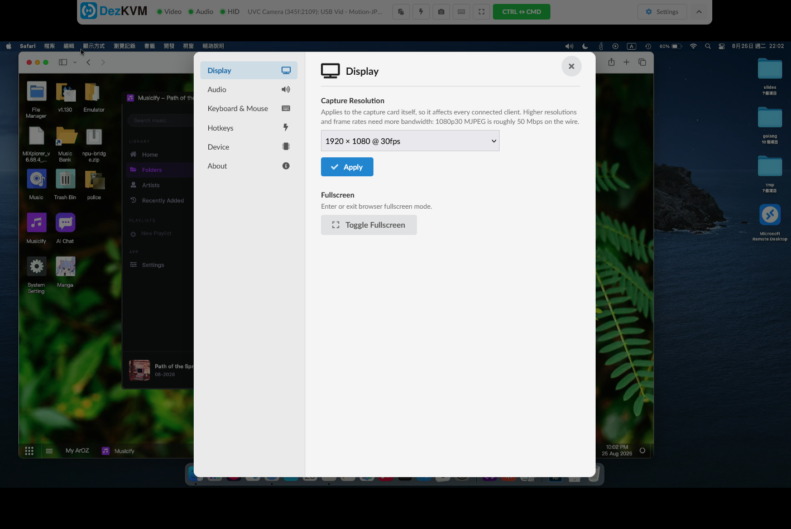
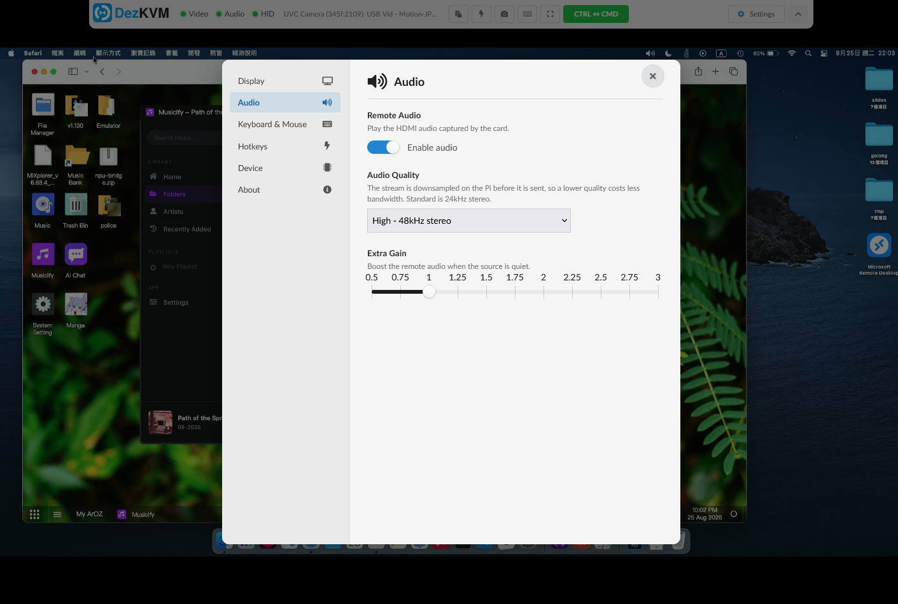
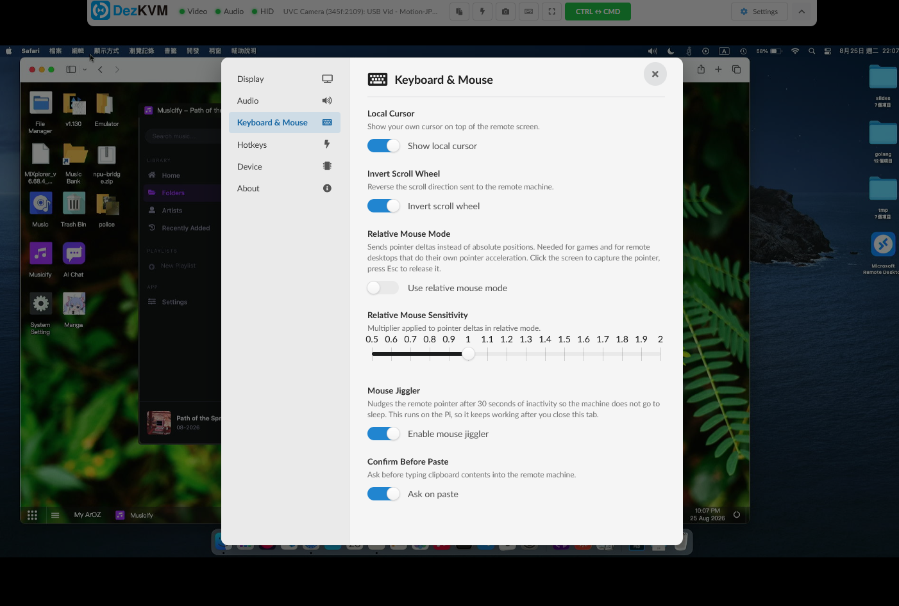

# DezKVM-Go — IP KVM mode

The network counterpart to the USB KVM.

In local mode the browser drives the hardware itself: WebSerial for the CH9329 and `getUserMedia` for the capture card, which means the DezKVM board has to be plugged into the machine you are sitting at. 

In IP KVM mode the board stays plugged into a Raspberry Pi (tested on RPI4), this program runs there, and any browser on the network gets the picture, the sound and the keyboard/mouse.

```
  target machine        Pi running this program with DezKVM-Go       your browser
 ┌──────────────┐  HDMI   ┌───────────────────────────────┐   HTTP  ┌───────────┐
 │              ├────────►│ MS2109(S) ──► /dev/videoN ────┼────────►│      │
 │              │         │           ──► /dev/snd/pcm…───┼── WS ──►│ WebAudio  │
 │              │◄────────┤ CH9329 ◄── CH340 ◄─ /dev/tty… │◄─ WS ───┤ key/mouse │
 └──────────────┘   USB   └───────────────────────────────┘         └───────────┘
```

## Running

```bash
cd ipkvm_src/
go run .
```

Then open `http://<pi-address>:8080`.

Everything is detected automatically, so no flags are needed in the normal case.
`start.sh` is a thin wrapper around the same thing.

### Dependencies

Raspberry Pi OS should come with all required dependencies pre-installed. In case you are using the Raspberry Pi OS Lite variant, you might need to install the following tools manually

```
sudo apt update
sudo apt install v4l-utils alsa-utils

# Optional, but maybe one day we will support WebRTC with H264 streaming?
sudo apt install ffmpeg 
```


## Command line flags

| Flag | Default | Purpose |
|------|---------|---------|
| `-video` | auto | Video capture node, e.g. `/dev/video0` |
| `-audio` | auto | ALSA capture PCM node, e.g. `/dev/snd/pcmC3D0c` |
| `-tty` | auto | CH9329 serial port, e.g. `/dev/ttyUSB0` |
| `-port` | `:8080` | HTTP listening address |
| `-baud` | `115200` | CH9329 serial baud rate |
| `-width` / `-height` | largest | Capture resolution |
| `-fps` | `30` | Maximum capture frame rate |
| `-jpeg-quality` | `0` (off) | Re-encode frames at this quality (5–80) to cut bandwidth |
| `-scroll-sensitivity` | `2` | Mouse wheel step sent to the CH9329 |
| `-dev` | `false` | Serve the UI from `www/` on disk instead of the embedded copy |
| `-no-hid` | `false` | Video/audio only, do not open the serial port |
| `-list-devices` | — | Print every detectable device and exit |

To start it automatically at boot, see
[Running as a service on Raspberry Pi](#running-as-a-service-on-raspberry-pi).

## Device auto detection

The kernel hands out `/dev/videoN`, `/dev/snd/pcmCxDyc` and `/dev/ttyUSBn` in
probe order, so the numbers move whenever the host boots with a different set of
USB devices attached. Instead of guessing, the detector walks sysfs and matches
on USB vendor/product IDs:

* **Video** — every `/dev/videoN` that advertises a discrete MJPEG capture format
  (which also filters out the metadata node a UVC card exposes alongside the
  streaming one), preferring a known capture chip: MacroSilicon `345f:2109`
  (MS2109S), `345f:2130`, `534d:2109`, `534d:2130`.
* **Audio** — the capture card puts its video and audio interfaces on the *same*
  USB device, so the PCM node is simply the sound card hanging off the same USB
  device directory as the video node.
* **Serial** — a WCH bridge (`1a86:7523` CH340, `1a86:5523` CH341, `1a86:7522`,
  `1a86:55d4` CH9102). When several are present, the one on the same internal hub
  as the capture card wins, since that is how a DezKVM board is wired.

Each tier falls back to "first plausible device" if nothing is recognised, and
`-list-devices` shows what was found:

```
$ go run . -list-devices
Video capture devices (MJPEG capable):
  * /dev/video0    345f:2109    UVC Camera (345f:2109): USB Vid

Audio capture devices:
  * /dev/snd/pcmC3D0c      345f:2109    U0x345f0x2109

Serial ports:
  * /dev/ttyUSB0   1a86:7523

  (* = recognised DezKVM hardware)
```

## HTTP interface

| Endpoint | Purpose |
|----------|---------|
| `GET /` | Web UI |
| `GET /api/video/stream` | `multipart/x-mixed-replace` MJPEG stream |
| `GET /api/video/screenshot` | Single JPEG frame |
| `GET /api/video/resolutions` | Supported MJPEG sizes and frame rates |
| `POST /api/video/resolution?width=&height=&fps=` | Change the capture format |
| `GET /api/status` | Device nodes, capture state, stream info |
| `POST /api/hid/reset` | CH9329 soft reset + release all modifiers |
| `POST /api/hid/jiggler?enable=` | Server-side mouse jiggler |
| `GET /ws/hid` | JSON HID events (see `mod/kvmhid/typedef.go`) |
| `GET /ws/audio?quality=low\|standard\|high` | Raw S16LE stereo PCM |

Audio quality also picks the sample rate, because the backend downsamples by
dropping frames: `high` = 48kHz, `standard` = 24kHz, `low` = 16kHz.

### Screenshots











## Running as a service on Raspberry Pi

`dezkvm-ipkvm.service` is a ready-to-edit systemd unit that starts the KVM at
boot. Build the binary, put it somewhere permanent, then install the unit:

```bash
# 1. Build a standalone binary (the web UI is embedded, so this one file is all
#    you need at runtime - no www/ folder, no go toolchain)
cd ipkvm_src
go build -o dezkvm-ipkvm .

# 2. Install it
sudo mkdir -p /opt/dezkvm-ipkvm
sudo cp dezkvm-ipkvm /opt/dezkvm-ipkvm/

# 3. Install the unit
sudo cp dezkvm-ipkvm.service /etc/systemd/system/
sudo systemctl daemon-reload
sudo systemctl enable --now dezkvm-ipkvm
```

Check that it came up:

```bash
systemctl status dezkvm-ipkvm
journalctl -u dezkvm-ipkvm -f
```

The log should name the three device nodes it picked, the same as running it by
hand.

### Editing the unit

The shipped file assumes the binary is at `/opt/dezkvm-ipkvm/dezkvm-ipkvm` and
runs as user `pi`. Change `User=`, `WorkingDirectory=` and `ExecStart=` if that
does not match your setup, then `sudo systemctl daemon-reload`.

Extra flags go on the `ExecStart=` line, for example to move it off port 8080
and cut the bitrate:

```ini
ExecStart=/opt/dezkvm-ipkvm/dezkvm-ipkvm -port :9000 -jpeg-quality 60
```

### Permissions

The service does not run as root. Access to the three device nodes comes from
group membership instead, which the unit requests via `SupplementaryGroups=`:

| Device | Group |
|--------|-------|
| `/dev/videoN` | `video` |
| `/dev/snd/pcmCxDyc` | `audio` |
| `/dev/ttyUSBn` | `dialout` |

On Raspberry Pi OS the `pi` user is already in all three. For a different user:

```bash
sudo usermod -aG video,audio,dialout <user>
```

`PrivateDevices=` is deliberately *not* set in the unit - it would hide exactly
the device nodes the service needs.

### Cold boot timing

USB enumeration is not finished the instant systemd reaches `multi-user.target`,
so on a cold boot the capture card may not exist yet. The unit handles this two
ways: an `ExecStartPre=/bin/sleep 5` before the first attempt, and
`Restart=on-failure` with `RestartSec=5` in case that is still not enough. If
your board is consistently slower, raise the sleep.

If you would rather have systemd wait for the hardware itself than sleep, drop
the `ExecStartPre` and bind the unit to the device instead:

```ini
BindsTo=dev-ttyUSB0.device
After=dev-ttyUSB0.device
```

That ties the service to one fixed node name though, which is the very thing the
auto detection exists to avoid, so it is only worth doing on a board where
nothing else is ever plugged in.

### Stopping and removing

```bash
sudo systemctl disable --now dezkvm-ipkvm
sudo rm /etc/systemd/system/dezkvm-ipkvm.service
sudo systemctl daemon-reload
```


## Self Hosting Notes

T**his IP-KVM mode implementation for DezKVM-Go device contains no authentication system nor it serve it contents in encrypted (HTTPS). If you want to expose this to the internet, you must introduce some sort of authentication gateway and proxy the traffic using HTTPS for security reasons.** 

If you are looking for an easy to use and feature rich reverse proxy server, feel free to checkout [Zoraxy](https://zoraxy.aroz.org) which got builds in ACME tools for getting free HTTPS certificate as well as Zoraxy Auth SSO system.


## License

AGPL
